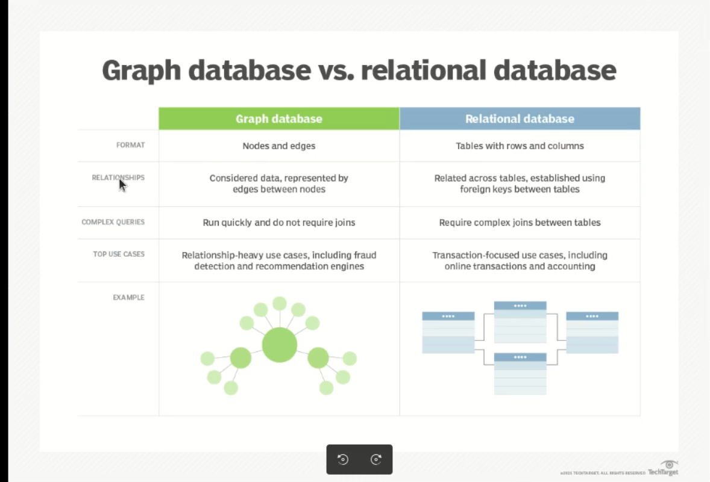
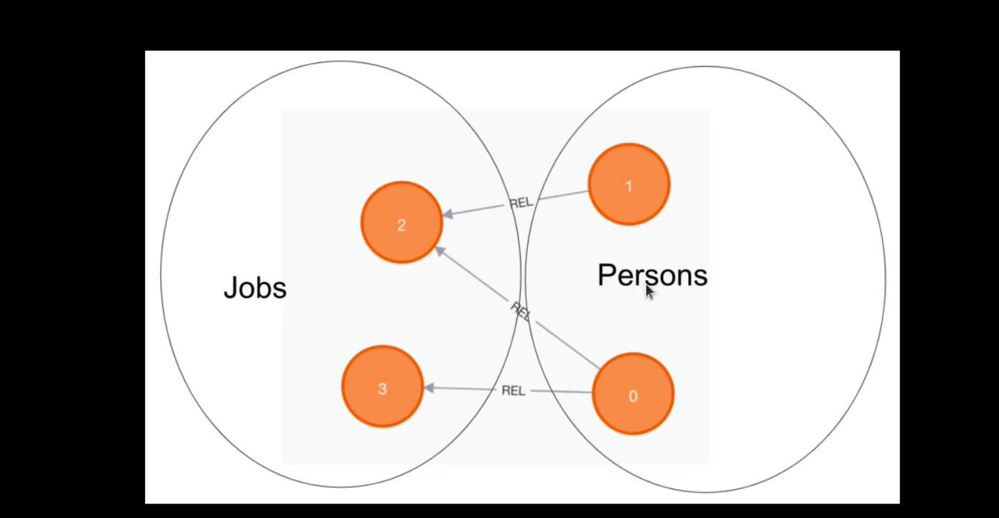
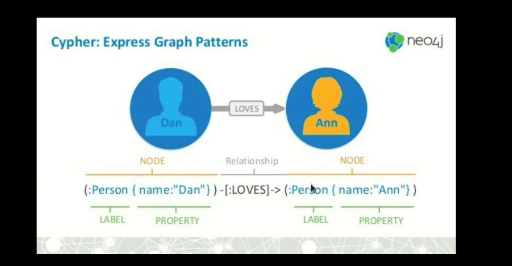

# Neo4j Learning Guide

## This Time We Learn Neo4j

### What is Neo4j?
1. Neo4j is a graph-based database.
2. It has a query language called Cypher.
3. It is written in Java.
4. It is appropriate for situations where the data may frequently change, but the relationships between the data are crucial.

### 
- Circles in the image are called Nodes.
- `--->` represents relationships or edges.
- All edges are one-way.
- For example, you can find a keyboard, but the keyboard cannot find you.

### Why is it Good?
1. Neo4j is ideal for handling irregular data with strong relationships.

### Where is it Useful?
Neo4j can be particularly useful in scenarios such as:

- **E-commerce**: On a shopping website, if you're browsing for a keyboard and close all your tabs, you might then see a targeted advertisement when you visit a dictionary site.
- **Social Networks**: On LinkedIn, you might see that "Mmd" follows someone you also follow, even though you don't know "Mmd" personally. This common connection is an example of how Neo4j can analyze and display relationships between users.

### 
## Website 
### Cypher
1. Development > Documentation > Cypher
- Clauses form the basic queries.
- Syntax

## Getting Started

### Prerequisites
- Java Development Kit (JDK)
- Neo4j Community Edition

## SQL and Neo4j
1. In SQL, we use joins, but in Neo4j we traverse.
   - Joins in SQL are heavy and complex, which can lower performance. Traversals in Neo4j are quick and do not impact query speed.
2. Top Use Case:
   - When our data varies frequently, it is not ideal to use SQL.

### 

## What is a Label?
Each category we have is called a label. For example, in the picture, we have jobs and persons as labels.

### 
### 

## Neo4j Basics
- `a`, `or`, `n`, etc., are just variables and do not affect our code.

1. **Create**
   1. **Node**
      ```cypher
      CREATE(nameNode)
      ```
   2. **Create Node with label `person` and `developer` with values**
      ```cypher
      CREATE(a:person:developer {name:'afshin', age:90})
      CREATE(b:person:devops {name:'jack', age:41})
      CREATE(n:person:cto {name:'ali', age:80}) RETURN b
      ```

2. **Match (find)**
   1. Return all data
      ```cypher
      MATCH(x) RETURN x;
      ```
   2. Where on the properties
      ```cypher
      MATCH(n) WHERE x.name = 'afshin' RETURN n
      ```
   3. Match with label and properties
      ```cypher
      MATCH(b:developer) RETURN b.age
      MATCH(a {name:'saeid'}) RETURN a
      ```
   4. Match that a person has the label `developer` and a relation with a person who is also a developer
      ```cypher
      MATCH (a:developer) -- (:developer) RETURN a
      MATCH (a:person) --> (:developer) RETURN a
      MATCH(a:person) -[r]-> (:developer) RETURN type(r) #is_friend
      MATCH(a:person) -[:is_friend]-> (:developer) RETURN a    
      ```

3. **Relation**
   1. Create a relation between two nodes, where `afshin` is friends with `jack` but `jack` is not friends with `afshin`
      ```cypher
      MATCH (a:person),(b:person) 
      WHERE a.name='afshin' AND b.name='jack'
      CREATE (a)-[:is_friend]->(b)
      ```

4. **Delete (for node and relation)**
   1. Without relation
      ```cypher
      MATCH(x {name:'afshin'}) DELETE x
      ```
   2. If we have a relation:
      ```cypher
      MATCH(x {name:'afshin'}) -[r:is_friend]->() DELETE r
      MATCH(n) DETACH DELETE n
      ```

5. **Remove (for properties)**
   1. Remove properties
      ```cypher
      MATCH(n {name:'saeid'}) REMOVE n.age RETURN n
      ```
   2. Remove label
      ```cypher
      MATCH(n {name:'saeid'}) REMOVE n:person RETURN n
      ```

6. **Set (for add or update and delete properties)**
   ```cypher
   MATCH(n {name:'afshin'}) SET n.name = 'mehdi' RETURN n
   MATCH(n {name:'afshin'}) SET n.name = true RETURN n
   MATCH(a:developer),(b:cto) SET b = a
   ```

7. **Merge (create + match)**
   ```cypher
   MERGE(n:person) RETURN n
   MERGE(n:person) ON MATCH SET n.age = 90
   ```

8. **Order By, Skip, Limit**
   ```cypher
   MATCH(n) RETURN n ORDER BY n.age ASC [DESC]
   MATCH(n) RETURN n SKIP 2
   MATCH(n) RETURN n LIMIT 2
   ```

## Function String
1. `left(n.name,3)` ==> returns the first 3 characters of the text.
2. `ltrim()` => removes leading whitespaces.
3. `replace()` => replaces specified characters.
4. `right()` => returns characters from the right.
5. `split()`.
6. `substring()` => extracts a substring.
7. `tolower()`.

## List
You can store multiple values with one key.
```cypher
MATCH(n:cto {name:['amir','afshin']})
```

## Index
Indexes improve query performance by copying specific properties.
```cypher
CREATE INDEX person_index FOR (n:person) ON (n.age)
:schema
```

### Installation

1. **Install Neo4j**:
   - Download and install the Neo4j Community Edition from the [official website](https://neo4j.com/download/).

2. **Start Neo4j**:
   - Open the Neo4j application and start the database.

3. **Connect to Neo4j**:
   - Use the default username and password (usually `neo4j` and `neo4j`).

### Usage

1. **Open Neo4j Browser**:
   - Access the Neo4j Browser at `http://localhost:7474`.

2. **Run Cypher Queries**:
   - Example query to create a node:
     ```cypher
     CREATE (n:Person {name: 'John Doe', age: 30})
     ```
   - Example query to find nodes:
     ```cypher
     MATCH (n:Person) RETURN n
     ```

3. **Shell Docker**:
   ```sh
   sudo docker exec -it neo4j cypher-shell -u neo4j -p pass 
   CREATE ();
   MATCH(n) RETURN n;
   ```

### Learning Resources
- [Neo4j Documentation](https://neo4j.com/docs/)
- [Cypher Query Language](https://neo4j.com/developer/cypher/)
- [Neo4j Tutorials](https://neo4j.com/developer/neo4j-tutorials/)

## Contributing

If you want to contribute to this project, please fork the repository and use a feature branch. Pull requests are warmly welcome.

## License

This project is licensed under the MIT License - see the [LICENSE](LICENSE) file for details.