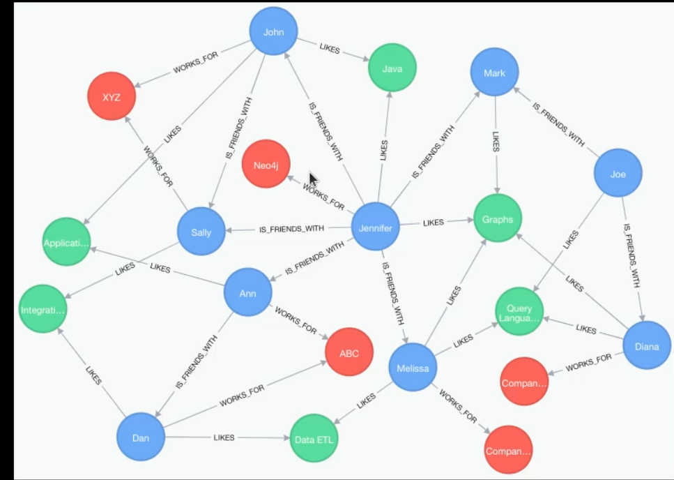

# Neo4j Learning Guide

## This Time We Learn Neo4j

### What is Neo4j?
1. Neo4j is a graph-based database.
2. It has a query language called Cypher.
3. It is written in Java.
4. it is approprate for that' data is not important but the relation is very important for us
### 
*cilcle in image call Node
* ----> call relation or edges<edg>
all the edges are One way.
me found the keyboard and keyboard not dound me
### Why is it Good?
Neo4j is ideal for handling irregular data with strong relationships.

### Where is it Useful?
Neo4j can be particularly useful in scenarios such as:

- **E-commerce**: On a shopping website, if you're browsing for a keyboard and close all your tabs, you might then see a targeted advertisement when you visit a dictionary site.
- **Social Networks**: On LinkedIn, you might see that "Mmd" follows someone you also follow, even though you don't know "Mmd" personally. This common connection is an example of how Neo4j can analyze and display relationships between users.
### 
#
## Getting Started

### Prerequisites
- Java Development Kit (JDK)
- Neo4j Community Edition

### Installation

1. **Install Neo4j**:
   - Download and install the Neo4j Community Edition from the [official website](https://neo4j.com/download/).
   
2. **Start Neo4j**:
   - Open the Neo4j application and start the database.

3. **Connect to Neo4j**:
   - Use the default username and password (usually `neo4j` and `neo4j`).

### Usage

1. **Open Neo4j Browser**:
   - Access the Neo4j Browser at `http://localhost:7474`.

2. **Run Cypher Queries**:
   - Example query to create a node:
     ```cypher
     CREATE (n:Person {name: 'John Doe', age: 30})
     ```
   - Example query to find nodes:
     ```cypher
     MATCH (n:Person) RETURN n
     ```

### Learning Resources
- [Neo4j Documentation](https://neo4j.com/docs/)
- [Cypher Query Language](https://neo4j.com/developer/cypher/)
- [Neo4j Tutorials](https://neo4j.com/developer/neo4j-tutorials/)

## Contributing

If you want to contribute to this project, please fork the repository and use a feature branch. Pull requests are warmly welcome.

## License

This project is licensed under the MIT License - see the [LICENSE](LICENSE) file for details.
